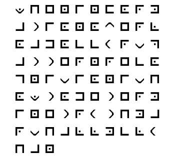
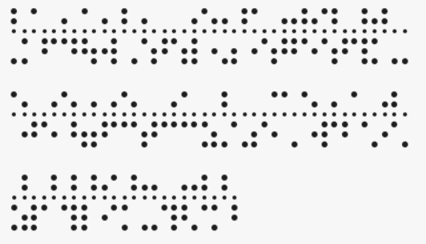

# Text Manipulation Cheat Sheet

## Purpose

The purpose of this document is to list common text manipulation techniques and provide samples. People are great at pattern recognision, so the samples should help identify used technique while trying to crack some challenge. This might become in handy while participating in Capture-The-Flag (CTF) events.

The following string is used for samples:

> `When information overload occurs, pattern recognision is how to determine truth. - Marshall McLuhan`

***

## Content

#### [ALPHABET](#ALPHABET)
* [FLIPPED](#FLIPPED)
* [HTML ENTITIES](#HTML_ENTITIES)
* [MORSE CODE](#MORSE_CODE)
* [LEETSPEAK](#LEETSPEAK)
* [NAVAJO CODE](#NAVAJO_CODE)
* [PGP WORD LIST](#PGP_WORD_LIST)
* [NATO PHONETIC ALPHABET](#NATO_PHONETIC_ALPHABET)

#### [NUMERIC](#NUMERIC)
* [DECIMAL](#DECIMAL)
* [BINARY](#BINARY)
* [OCTAL](#OCTAL)
* [HEXADECIMAL](#HEXADECIMAL)
* [ROMAN NUMERALS](#ROMAN_NUMERALS)

#### [SIMPLE SUBSTITUTION](#SIMPLE_SUBSTITUTION)
* [ROT13](#ROT13)
* [ROT47](#ROT47)
* [CAESAR CIPHER](#CAESAR_CIPHER)
* [ATBASH LATIN](#ATBASH_LATIN)
* [VIGENERE CIPHER](#VIGENERE_CIPHER)
* [PIGPEN CIPHER](#PIGPEN_CIPHER)

#### [ENCODING](#ENCODING)
* [URL (Percent-encoding)](#URL)
* [BRAIN FUCK](#BRAIN_FUCK)
* [JS FUCK](#JS_FUCK)
* [BASE16](#BASE16)
* [BASE32](#BASE32)
* [BASE64](#BASE64)
* [ASCII85](#ASCII85)
* [BAUDOT-MURRAY-CODE](#BAUDOT-MURRAY-CODE)

***

# Samples

## <a name="ALPHABET"></a>ALPHABET

### <a name="FLIPPED"></a>FLIPPED
```
nahuLcM llahsraM - .hturt enimreted ot woh si noisingocer nrettap ,srucco daolrevo noitamrofni nehW
```
* [Converter]()
* [About]()

### <a name="HTML_ENTITIES"></a>HTML ENTITIES
```html
&#87;&#104;&#101;&#110;&#32;&#105;&#110;&#102;&#111;&#114;&#109;&#97;&#116;&#105;&#111;&#110;&#32;&#111;&#118;&#101;&#114;&#108;&#111;&#97;&#100;&#32;&#111;&#99;&#99;&#117;&#114;&#115;&#44;&#32;&#112;&#97;&#116;&#116;&#101;&#114;&#110;&#32;&#114;&#101;&#99;&#111;&#103;&#110;&#105;&#115;&#105;&#111;&#110;&#32;&#105;&#115;&#32;&#104;&#111;&#119;&#32;&#116;&#111;&#32;&#100;&#101;&#116;&#101;&#114;&#109;&#105;&#110;&#101;&#32;&#116;&#114;&#117;&#116;&#104;&#46;&#32;&#45;&#32;&#77;&#97;&#114;&#115;&#104;&#97;&#108;&#108;&#32;&#77;&#99;&#76;&#117;&#104;&#97;&#110;
```
* [Converter](https://v2.cryptii.com/text/htmlentities)
* [About](https://en.wikipedia.org/wiki/Character_encodings_in_HTML#Character_references)

### <a name="MORSE_CODE"></a>MORSE CODE
```
Separator: space
Long: -
Short: .
Space /
```
```
.-- .... . -. / .. -. ..-. --- .-. -- .- - .. --- -. / --- ...- . .-. .-.. --- .- -.. / --- -.-. -.-. ..- .-. ... --..-- / .--. .- - - . .-. -. / .-. . -.-. --- --. -. .. ... .. --- -. / .. ... / .... --- .-- / - --- / -.. . - . .-. -- .. -. . / - .-. ..- - .... / / -- .- .-. ... .... .- .-.. .-.. / -- -.-. .-.. ..- .... .- -.
```
* [Converter](https://v2.cryptii.com/text/morsecode)
* [About](https://en.wikipedia.org/wiki/Morsecode)

### <a name="LEETSPEAK"></a>LEETSPEAK

Easy
```
WH3N 1nfoRmA71oN OV3RLoAD oCcur2, PA773Rn r3co9N1S1oN 12 hOw 7O D373rm1n3 7ru7H. - MArShALL MCLUhaN
```
Pro
```
\/\/|-|E|\| 1|\||=0R|\/|4+10|\| 0\/ER|_04|) 0((|_|r2, P4++Er|\| Re(09|\|1$10|\| 12 |-|0\/\/ +0 |)e+er|\/|1|\|E +r|_|+|-|. - |\/|4R$|-|4|_|_ |\/|(|_|_||-|4|\|
```
* [Converter](http://1337.me/)
* [About]()

### <a name="NAVAJO_CODE"></a>NAVAJO CODE
```
GLOE-EH-NA-AH-WO-HAI BE-TKAH YEH-HES TSAH MA-E NE-AHS-JAH GAH TSIN-TLITI BE-LA-SANA D-AH A-CHI A-KHA TSAH BE-TKAH NE-AHS-JAH A-KEH-DI-GLINI AH-JAH GAH DIBEH-YAZZIE A-KHA WOL-LA-CHEE BE BE-TKAH A-KHA BA-GOSHI MOASI SHI-DA DAH-NES-TSA DIBEH  BE-TKAH CLA-GI-AIH BE-LA-SANA THAN-ZIE D-AH AH-JAH AH-LOSZ TSAH BE-TKAH AH-LOSZ AH-JAH MOASI TLO-CHIN KLIZZIE A-CHIN TKIN DIBEH A-CHI A-KHA A-CHIN BE-TKAH SEIS BE-TKAH TSE-GAH TLO-CHIN GLOE-IH BE-TKAH A-WOH TLO-CHIN BE-TKAH BE AH-NAH A-WOH AH-NAH AH-LOSZ TSIN-TLITI TKIN TSAH AH-JAH BE-TKAH D-AH DAH-NES-TSA NO-DA-IH THAN-ZIE TSE-GAH  BE-TKAH  BE-TKAH TSIN-TLITI WOL-LA-CHEE GAH KLESH TSE-GAH WOL-LA-CHEE DIBEH-YAZZIE DIBEH-YAZZIE BE-TKAH TSIN-TLITI BA-GOSHI AH-JAD SHI-DA TSE-GAH WOL-LA-CHEE A-CHIN
```
* [Converter](https://v2.cryptii.com/text/navajo)
* [About](https://en.wikipedia.org/wiki/Code_talker)

### <a name="PGP_WORD_LIST"></a>PGP WORD LIST
Biometric list(traditional PGP word list)
```
eightball frighten fracture goldfish bison gazelle goldfish framework gremlin highchair goggles fallout indoors gazelle gremlin goldfish bison gremlin inverse fracture highchair glucose gremlin fallout flytrap bison gremlin flatfoot flatfoot indulge highchair hockey Burbank bison guidance fallout indoors indoors fracture highchair goldfish bison highchair fracture flatfoot gremlin freedom goldfish gazelle hockey gazelle gremlin goldfish bison gazelle hockey bison frighten gremlin involve bison indoors gremlin bison flytrap fracture indoors fracture highchair goggles gazelle goldfish fracture bison indoors highchair indulge indoors frighten buzzard bison button bison dreadful fallout highchair hockey frighten fallout glucose glucose bison dreadful flatfoot drainage indulge frighten fallout goldfish
```
* [Converter](http://goto.pachanka.org/crypto/pgp-wordlist/)
* [About](https://en.wikipedia.org/wiki/PGP_word_list)

### <a name="NATO_PHONETIC_ALPHABET"></a>NATO PHONETIC ALPHABET
```
Whiskey Hotel Echo November India November Foxtrot Oscar Romeo Mike Alpha Tango India Oscar November Oscar Victor Echo Romeo Lima Oscar Alpha Delta Oscar Charlie Charlie Uniform Romeo Sierra, Papa Alpha Tango Tango Echo Romeo November Romeo Echo Charlie Oscar Golf November India Sierra India Oscar November India Sierra Hotel Oscar Whiskey Tango Oscar Delta Echo Tango Echo Romeo Mike India November Echo Tango Romeo Uniform Tango Hotel . - Mike Alpha Romeo Sierra Hotel Alpha Lima Lima Mike Charlie Lima Uniform Hotel Alpha November
```
* [Converter](http://www.togglecase.com/convert_to_phonetic_alphabet)
* [About](https://en.wikipedia.org/wiki/NATO_phonetic_alphabet)


## <a name="NUMERIC"></a>NUMERIC

### <a name="DECIMAL"></a>DECIMAL
```
87 104 101 110 32 105 110 102 111 114 109 97 116 105 111 110 32 111 118 101 114 108 111 97 100 32 111 99 99 117 114 115 44 32 112 97 116 116 101 114 110 32 114 101 99 111 103 110 105 115 105 111 110 32 105 115 32 104 111 119 32 116 111 32 100 101 116 101 114 109 105 110 101 32 116 114 117 116 104 46 32 45 32 77 97 114 115 104 97 108 108 32 77 99 76 117 104 97 110
```
* [Converter](https://v2.cryptii.com/text/decimal)
* [About](https://en.wikipedia.org/wiki/ASCII)

### <a name="BINARY"></a>BINARY
```
01010111 01101000 01100101 01101110 00100000 01101001 01101110 01100110 01101111 01110010 01101101 01100001 01110100 01101001 01101111 01101110 00100000 01101111 01110110 01100101 01110010 01101100 01101111 01100001 01100100 00100000 01101111 01100011 01100011 01110101 01110010 01110011 00101100 00100000 01110000 01100001 01110100 01110100 01100101 01110010 01101110 00100000 01110010 01100101 01100011 01101111 01100111 01101110 01101001 01110011 01101001 01101111 01101110 00100000 01101001 01110011 00100000 01101000 01101111 01110111 00100000 01110100 01101111 00100000 01100100 01100101 01110100 01100101 01110010 01101101 01101001 01101110 01100101 00100000 01110100 01110010 01110101 01110100 01101000 00101110 00100000 00101101 00100000 01001101 01100001 01110010 01110011 01101000 01100001 01101100 01101100 00100000 01001101 01100011 01001100 01110101 01101000 01100001 01101110
```
* [Converter](https://v2.cryptii.com/text/binary)
* [About](https://en.wikipedia.org/wiki/ASCII)

### <a name="OCTAL"></a>OCTAL
```
127 150 145 156 40 151 156 146 157 162 155 141 164 151 157 156 40 157 166 145 162 154 157 141 144 40 157 143 143 165 162 163 54 40 160 141 164 164 145 162 156 40 162 145 143 157 147 156 151 163 151 157 156 40 151 163 40 150 157 167 40 164 157 40 144 145 164 145 162 155 151 156 145 40 164 162 165 164 150 56 40 55 40 115 141 162 163 150 141 154 154 40 115 143 114 165 150 141 156
```
* [Converter](https://v2.cryptii.com/text/octal)
* [About](https://en.wikipedia.org/wiki/ASCII)

### <a name="HEXADECIMAL"></a>HEXADECIMAL
```
57 68 65 6e 20 69 6e 66 6f 72 6d 61 74 69 6f 6e 20 6f 76 65 72 6c 6f 61 64 20 6f 63 63 75 72 73 2c 20 70 61 74 74 65 72 6e 20 72 65 63 6f 67 6e 69 73 69 6f 6e 20 69 73 20 68 6f 77 20 74 6f 20 64 65 74 65 72 6d 69 6e 65 20 74 72 75 74 68 2e 20 2d 20 4d 61 72 73 68 61 6c 6c 20 4d 63 4c 75 68 61 6e
```
* [Converter](https://v2.cryptii.com/text/hexadecimal)
* [About](https://en.wikipedia.org/wiki/ASCII)

### <a name="ROMAN_NUMERALS"></a>ROMAN NUMERALS
```
LXXXVII CIV CI CX XXXII CV CX CII CXI CXIV CIX XCVII CXVI CV CXI CX XXXII CXI CXVIII CI CXIV CVIII CXI XCVII C XXXII CXI XCIX XCIX CXVII CXIV CXV XLIV XXXII CXII XCVII CXVI CXVI CI CXIV CX XXXII CXIV CI XCIX CXI CIII CX CV CXV CV CXI CX XXXII CV CXV XXXII CIV CXI CXIX XXXII CXVI CXI XXXII C CI CXVI CI CXIV CIX CV CX CI XXXII CXVI CXIV CXVII CXVI CIV XLVI XXXII XLV XXXII LXXVII XCVII CXIV CXV CIV XCVII CVIII CVIII XXXII LXXVII XCIX LXXVI CXVII CIV XCVII CX
```
* [Converter](https://v2.cryptii.com/text/roman-numerals)
* [About](https://en.wikipedia.org/wiki/Roman_numerals)


## <a name="SIMPLE_SUBSTITUTION"></a>SIMPLE SUBSTITUTION

### <a name="ROT13"></a>ROT13
```
Jura vasbezngvba bireybnq bpphef, cnggrea erpbtavfvba vf ubj gb qrgrezvar gehgu. - Znefunyy ZpYhuna
```
* [Converter](https://v2.cryptii.com/text/rot13)
* [About](https://en.wikipedia.org/wiki/ROT13)

### <a name="ROT47"></a>ROT47
```
(96? :?7@C>2E:@? @G6C=@25 @44FCD[ A2EE6C? C64@8?:D:@? :D 9@H E@ 56E6C>:?6 ECFE9] \ |2CD92== |4{F92?
```
* [Converter](https://www.dcode.fr/rot-47-cipher)
* [About](https://en.wikipedia.org/wiki/ROT13#Variants)

### <a name="CAESAR_CIPHER"></a>CAESAR CIPHER
Shift = `1`
```
XIFO JOGPSNBUJPO PWFSMPBE PDDVST, QBUUFSO SFDPHOJTJPO JT IPX UP EFUFSNJOF USVUI. - NBSTIBMM NDMVIBO
```
Shift = `4`
```
ALIR MRJSVQEXMSR SZIVPSEH SGGYVW, TEXXIVR VIGSKRMWMSR MW LSA XS HIXIVQMRI XVYXL. - QEVWLEPP QGPYLER
```
* [Converter](https://v2.cryptii.com/text/caesar)
* [About](https://en.wikipedia.org/wiki/Caesar_cipher)


### <a name="ATBASH_LATIN"></a>ATBASH LATIN
```
DSVM RMULINZGRLM LEVIOLZW LXXFIH, KZGGVIM IVXLTMRHRLM RH SLD GL WVGVINRMV GIFGS. - NZIHSZOO NXOFSZM
```
* [Converter](https://v2.cryptii.com/text/atbash)
* [About](https://en.wikipedia.org/wiki/Atbash)

### <a name="VIGENERE_CIPHER"></a>VIGENERE CIPHER
Key = `passphrase`
```
LHWF PEFGVBALADU ONIGLGSS FCUYGS EHKTWVC JWRVXNAWXOF XZ HGA TG SLKEJQXNW IYLTZ  EPYJHSPA EUABYAF
```
* [Converter](https://v2.cryptii.com/text/vigenere)
* [About](https://en.wikipedia.org/wiki/Vigen%C3%A8re_cipher)

### <a name="PIGPEN_CIPHER"></a>PIGPEN CIPHER


* [Converter](https://www.dcode.fr/pigpen-cipher)
* [About](https://en.wikipedia.org/wiki/Pigpen_cipher)


## <a name="ENCODING"></a>ENCODING

### <a name="URL"></a>URL (Percent-encoding)
```
%57%68%65%6e%20%69%6e%66%6f%72%6d%61%74%69%6f%6e%20%6f%76%65%72%6c%6f%61%64%20%6f%63%63%75%72%73%2c%20%70%61%74%74%65%72%6e%20%72%65%63%6f%67%6e%69%73%69%6f%6e%20%69%73%20%68%6f%77%20%74%6f%20%64%65%74%65%72%6d%69%6e%65%20%74%72%75%74%68%2e%20%2d%20%4d%61%72%73%68%61%6c%6c%20%4d%63%4c%75%68%61%6e
```
* [Converter](https://urldecode.org/)
* [About](https://en.wikipedia.org/wiki/Percent-encoding)

### <a name="BRAIN_FUCK"></a>BRAIN FUCK
```
++++++++++[>+>+++>+++++++>++++++++++<<<<-]>>>>-------------.+++++++++++++++++.---.+++++++++.<<++.>>-----.+++++.--------.+++++++++.+++.-----.------------.+++++++++++++++++++.-----------.++++++.-.<<.>>+.+++++++.-----------------.+++++++++++++.------.+++.--------------.+++.<<.>>+++++++++++.------------..++++++++++++++++++.---.+.<<++++++++++++.------------.>>---.---------------.+++++++++++++++++++..---------------.+++++++++++++.----.<<.>>++++.-------------.--.++++++++++++.--------.+++++++.-----.++++++++++.----------.++++++.-.<<.>>-----.++++++++++.<<.>>-----------.+++++++.++++++++.<<.>>---.-----.<<.>>-----------.+.+++++++++++++++.---------------.+++++++++++++.-----.----.+++++.---------.<<.>>+++++++++++++++.--.+++.-.------------.<<++++++++++++++.--------------.+++++++++++++.-------------.>+++++++.>-------.+++++++++++++++++.+.-----------.-------.+++++++++++..<<.>.>---------.<-.>++++++++++++++++++.-------------.-------.+++++++++++++.
```
* [Converter](https://www.dcode.fr/brainfuck-language)
* [About](https://en.wikipedia.org/wiki/Brainfuck)


### <a name="JS_FUCK"></a>JS FUCK

Encoded string `"test"`
```
([]+[])[(![]+[])[+[]]+(!![]+[][(![]+[])[+[]]+([![]]+[][[]])[+!+[]+[+[]]]+(![]+[])[!+[]+!+[]]+(!![]+[])[+[]]+(!![]+[])[!+[]+!+[]+!+[]]+(!![]+[])[+!+[]]])[+!+[]+[+[]]]+([][[]]+[])[+!+[]]+(!![]+[])[+[]]+([][(![]+[])[+[]]+([![]]+[][[]])[+!+[]+[+[]]]+(![]+[])[!+[]+!+[]]+(!![]+[])[+[]]+(!![]+[])[!+[]+!+[]+!+[]]+(!![]+[])[+!+[]]]+[])[!+[]+!+[]+!+[]]+(!![]+[][(![]+[])[+[]]+([![]]+[][[]])[+!+[]+[+[]]]+(![]+[])[!+[]+!+[]]+(!![]+[])[+[]]+(!![]+[])[!+[]+!+[]+!+[]]+(!![]+[])[+!+[]]])[+!+[]+[+[]]]+(![]+[])[!+[]+!+[]]+(!![]+[][(![]+[])[+[]]+([![]]+[][[]])[+!+[]+[+[]]]+(![]+[])[!+[]+!+[]]+(!![]+[])[+[]]+(!![]+[])[!+[]+!+[]+!+[]]+(!![]+[])[+!+[]]])[+!+[]+[+[]]]+(!![]+[])[+!+[]]]()[+!+[]+[!+[]+!+[]]]+(!![]+[])[+[]]+(!![]+[])[!+[]+!+[]+!+[]]+(![]+[])[!+[]+!+[]+!+[]]+(!![]+[])[+[]]+([]+[])[(![]+[])[+[]]+(!![]+[][(![]+[])[+[]]+([![]]+[][[]])[+!+[]+[+[]]]+(![]+[])[!+[]+!+[]]+(!![]+[])[+[]]+(!![]+[])[!+[]+!+[]+!+[]]+(!![]+[])[+!+[]]])[+!+[]+[+[]]]+([][[]]+[])[+!+[]]+(!![]+[])[+[]]+([][(![]+[])[+[]]+([![]]+[][[]])[+!+[]+[+[]]]+(![]+[])[!+[]+!+[]]+(!![]+[])[+[]]+(!![]+[])[!+[]+!+[]+!+[]]+(!![]+[])[+!+[]]]+[])[!+[]+!+[]+!+[]]+(!![]+[][(![]+[])[+[]]+([![]]+[][[]])[+!+[]+[+[]]]+(![]+[])[!+[]+!+[]]+(!![]+[])[+[]]+(!![]+[])[!+[]+!+[]+!+[]]+(!![]+[])[+!+[]]])[+!+[]+[+[]]]+(![]+[])[!+[]+!+[]]+(!![]+[][(![]+[])[+[]]+([![]]+[][[]])[+!+[]+[+[]]]+(![]+[])[!+[]+!+[]]+(!![]+[])[+[]]+(!![]+[])[!+[]+!+[]+!+[]]+(!![]+[])[+!+[]]])[+!+[]+[+[]]]+(!![]+[])[+!+[]]]()[+!+[]+[!+[]+!+[]]]
```
* [Converter](http://www.jsfuck.com/)
* [About](https://github.com/aemkei/jsfuck)


### <a name="BASE16"></a>BASE16
```
5768656E20696E666F726D6174696F6E206F7665726C6F6164206F63637572732C207061747465726E207265636F676E6973696F6E20697320686F7720746F2064657465726D696E652074727574682E202D204D61727368616C6C204D634C7568616E
```
* [Converter](http://www.simplycalc.com/base16-encode.php)
* [About](https://en.wikipedia.org/wiki/Hexadecimal)


### <a name="BASE32"></a>BASE32
```
K5UGK3RANFXGM33SNVQXI2LPNYQG65TFOJWG6YLEEBXWGY3VOJZSYIDQMF2HIZLSNYQHEZLDN5TW42LTNFXW4IDJOMQGQ33XEB2G6IDEMV2GK4TNNFXGKIDUOJ2XI2BOEAWSATLBOJZWQYLMNQQE2Y2MOVUGC3Q=
```
* [Converter](https://emn178.github.io/online-tools/base32_decode.html)
* [About](https://en.wikipedia.org/wiki/Base32)


### <a name="BASE64"></a>BASE64
```
V2hlbiBpbmZvcm1hdGlvbiBvdmVybG9hZCBvY2N1cnMsIHBhdHRlcm4gcmVjb2duaXNpb24gaXMgaG93IHRvIGRldGVybWluZSB0cnV0aC4gLSBNYXJzaGFsbCBNY0x1aGFu
```
* [Converter](https://v2.cryptii.com/text/base64)
* [About](https://en.wikipedia.org/wiki/Base64)

### <a name="ASCII85"></a>ASCII85
```
=(l/_+DG_*DfT]'FD5Z2+E)F7EboZ&A0>f#@s)g5/0Jn?FED)7DBNt2@rH!tBle!,DBNY7+D>\;+EVNEA7]joEc#N.AKZ)8F`_:L+>"^1@<-F&@;Ka&9k-k>BOPc
```
* [Converter](https://cryptii.com/ascii85-encoding)
* [About](https://en.wikipedia.org/wiki/Ascii85)

### <a name="BAUDOT-MURRAY-CODE"></a>BAUDOT-MURRAY-CODE
```
10011 10100 00001 01100 00100 00110 01100 01101 11000 01010 11100 00011 10000 00110 11000 01100 00100 11000 11110 00001 01010 10010 11000 00011 01001 00100 11000 01110 01110 00111 01010 00101 11011 01100 00100 11111 10110 00011 10000 10000 00001 01010 01100 00100 01010 00001 01110 11000 11010 01100 00110 00101 00110 11000 01100 00100 00110 00101 00100 10100 11000 10011 00100 10000 11000 00100 01001 00001 10000 00001 01010 11100 00110 01100 00001 00100 10000 01010 00111 10000 10100 11011 11100 00100 00011 00100 11111 11100 00011 01010 00101 10100 00011 10010 10010 00100 11100 01110 10010 00111 10100 00011 01100
```


* [Converter](https://v2.cryptii.com/text/ita2)
* [About](https://en.wikipedia.org/wiki/Baudot_code#ITA2)
